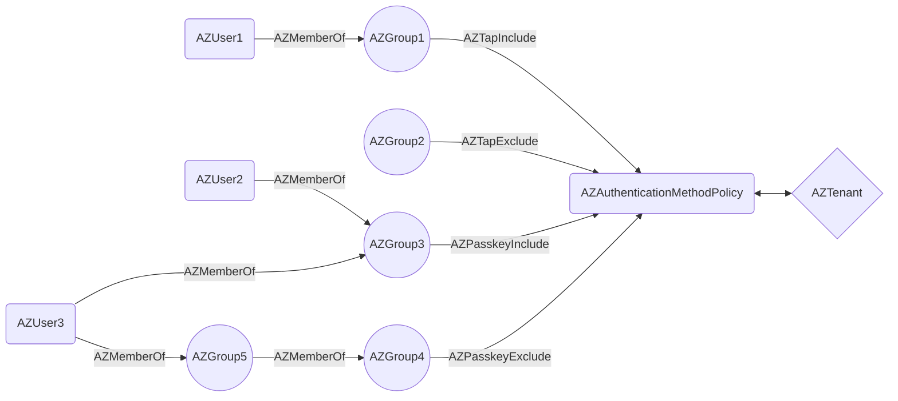
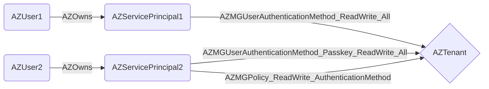

# BloodHound OpenGraph Entra ID Authentication Policy Data Collector


## Motivation

This PoC community project provides a sample `PowerShell` script that collects Microsoft Entra ID permissions related
to [Temporary Access Passes (TAPs)](https://learn.microsoft.com/en-us/entra/identity/authentication/howto-authentication-temporary-access-pass)
and [Passkeys (FIDO2)](https://learn.microsoft.com/en-us/entra/identity/authentication/how-to-enable-passkey-fido2)
and exports the data in [BloodHound OpenGraph](https://specterops.io/opengraph/) format.

## Collected Data

### Temporary Access Pass Authentication Method Policy

- [State](https://learn.microsoft.com/en-us/graph/api/temporaryaccesspassauthenticationmethodconfiguration-get?view=graph-rest-1.0&tabs=http)
- [IncludeTargets](https://learn.microsoft.com/en-us/graph/api/resources/temporaryaccesspassauthenticationmethodconfiguration?view=graph-rest-1.0#relationships)
- [ExcludeTargets](https://learn.microsoft.com/en-us/graph/api/resources/temporaryaccesspassauthenticationmethodconfiguration?view=graph-rest-1.0#properties)

### Passkey (FIDO2) Authentication Method Policy

- [State](https://learn.microsoft.com/en-us/graph/api/fido2authenticationmethodconfiguration-get?view=graph-rest-1.0&tabs=http)
- [IncludeTargets](https://learn.microsoft.com/en-us/graph/api/resources/fido2authenticationmethodconfiguration?view=graph-rest-1.0#relationships)
- [ExcludeTargets](https://learn.microsoft.com/en-us/graph/api/resources/fido2authenticationmethodconfiguration?view=graph-rest-1.0#properties)

### Service Principal Permissions

- [UserAuthenticationMethod.ReadWrite.All](https://learn.microsoft.com/en-us/graph/permissions-reference#userauthenticationmethodreadwriteall)
- [UserAuthMethod-Passkey.ReadWrite.All](https://learn.microsoft.com/en-us/graph/permissions-reference#userauthmethod-passkeyreadwriteall)
- [Policy.ReadWrite.AuthenticationMethod](https://learn.microsoft.com/en-us/graph/permissions-reference#policyreadwriteauthenticationmethod)

## Nodes and Edges

### Authentication Method Policy



### Application Permissions



### Privileged Roles

The following privileged roles are related to TAPs and Passkeys:

* [Global Administrator](https://learn.microsoft.com/en-us/entra/identity/role-based-access-control/permissions-reference#global-administrator)
* [Authentication Policy Administrator](https://learn.microsoft.com/en-us/entra/identity/role-based-access-control/permissions-reference#authentication-policy-administrator)
* [Privileged Authentication Administrator](https://learn.microsoft.com/en-us/entra/identity/role-based-access-control/permissions-reference#privileged-authentication-administrator)
* [Authentication Administrator](https://learn.microsoft.com/en-us/entra/identity/role-based-access-control/permissions-reference#authentication-administrator)

Assignments to these roles are collected by [AzureHound](https://github.com/SpecterOps/AzureHound) out-of-the-box.

## Files

| File                                    | Description                                                                  |
|-----------------------------------------|------------------------------------------------------------------------------|
| [Get-EntraAuthenticationPolicyData.ps1] | Main script that collects the data.                                          |
| [BloodHound.OpenGraph.Model.psm1]       | Helper PowerShell module implementing the BloodHound OpenGraph data model.   |
| [BloodHound.OpenGraph.Model.Tests.ps1]  | Simple [Pester] test cases for the data model.                               |
| [AuthenticationPolicyData_Sample.json]  | Sample file generated by the `Get-EntraAuthenticationPolicyData.ps1` script. |
| [bloodhound-opengraph.schema.json]      | A [JSON schema] file for BloodHound OpenGraph.                               |

[Get-EntraAuthenticationPolicyData.ps1]: ./Get-EntraAuthenticationPolicyData.ps1
[BloodHound.OpenGraph.Model.psm1]: ./BloodHound.OpenGraph.Model.psm1
[BloodHound.OpenGraph.Model.Tests.ps1]: ./BloodHound.OpenGraph.Model.Tests.ps1
[AuthenticationPolicyData_Sample.json]: ./AuthenticationPolicyData_Sample.json
[bloodhound-opengraph.schema.json]: ./bloodhound-opengraph.schema.json
[Pester]: https://pester.dev/
[JSON schema]: https://json-schema.org/learn/getting-started-step-by-step

## Sample Cypher Queries

Here are several sample Cypher queries related to Entra ID authentication method policies:

```cypher
MATCH (n:AZAuthenticationPolicy) RETURN n
```

```cypher
MATCH p=()-[:AZChangeAuthenticationPolicy]-() RETURN p
```

```cypher
MATCH p=()-[:AZTapInclude]-() RETURN p
```

```cypher
MATCH p=()-[:AZTapExclude]-() RETURN p
```

```cypher
MATCH path=(policy:AZAuthenticationPolicy)<-[:AZTapExclude]-(group:AZGroup)<-[:AZMemberOf*1..]-(entity) RETURN path
```

```cypher
MATCH p=()-[:AZMGUserAuthenticationMethod_ReadWrite_All]-() RETURN p
```

```cypher
MATCH p=()-[:AZMGUserAuthenticationMethod_Passkey_ReadWrite_All]-() RETURN p
```
