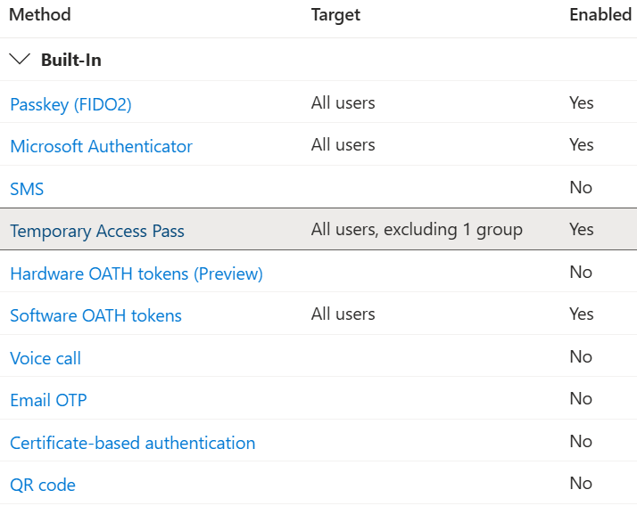

# BloodHound OpenGraph Entra ID Authentication Policy Data Collector


[](#)
[](LICENSE)

## Motivation

This PoC community project provides a sample `PowerShell` script that collects Microsoft Entra ID permissions related
to [Temporary Access Passes (TAPs)](https://learn.microsoft.com/en-us/entra/identity/authentication/howto-authentication-temporary-access-pass)
and [Passkeys (FIDO2)](https://learn.microsoft.com/en-us/entra/identity/authentication/how-to-enable-passkey-fido2)
and exports the data in [BloodHound OpenGraph](https://specterops.io/opengraph/) format.

## Author

### Michael Grafnetter

[](https://x.com/MGrafnetter)
[](https://www.dsinternals.com/en)
[](https://www.linkedin.com/in/grafnetter)

## Collected Data

The following data is colelcted by the PowerShell script from an Entra ID tenant:

### Temporary Access Pass Authentication Method Policy

- [State](https://learn.microsoft.com/en-us/graph/api/temporaryaccesspassauthenticationmethodconfiguration-get?view=graph-rest-1.0&tabs=http)
- [IncludeTargets](https://learn.microsoft.com/en-us/graph/api/resources/temporaryaccesspassauthenticationmethodconfiguration?view=graph-rest-1.0#relationships)
- [ExcludeTargets](https://learn.microsoft.com/en-us/graph/api/resources/temporaryaccesspassauthenticationmethodconfiguration?view=graph-rest-1.0#properties)

### Passkey (FIDO2) Authentication Method Policy

- [State](https://learn.microsoft.com/en-us/graph/api/fido2authenticationmethodconfiguration-get?view=graph-rest-1.0&tabs=http)
- [IncludeTargets](https://learn.microsoft.com/en-us/graph/api/resources/fido2authenticationmethodconfiguration?view=graph-rest-1.0#relationships)
- [ExcludeTargets](https://learn.microsoft.com/en-us/graph/api/resources/fido2authenticationmethodconfiguration?view=graph-rest-1.0#properties)

### Service Principal Permissions

- [UserAuthenticationMethod.ReadWrite.All]
- [UserAuthMethod-Passkey.ReadWrite.All]
- [Policy.ReadWrite.AuthenticationMethod]

## Nodes and Edges

The following new nodes and edges are created based on the data collected:

### AZAuthenticationPolicy Node

This node represents the tenant-wide authentication method policy:



Only a subset of the available settings is ingested. The following **boolean** properties are configured on the AZAuthenticationPolicy node:

| Property                | Description |
|-------------------------|-------------|
| tapEnabled              | |
| tapIncludesAllUsers     | |
| passkeyIncludesAllUsers | |
| passkeyEnabled          | |

### AZTapInclude Edge

### AZTapExclude Edge

### AZPasskeyInclude Edge

### AZPasskeyExclude Edge


### AZMGPolicy_ReadWrite_AuthenticationMethod Edge

### AZChangeAuthenticationPolicy Edge

This edge indicates who is in control of the authentication method policies, i.e,
service principals with the [Policy.ReadWrite.AuthenticationMethod] permission and the [Global Administrator] and [Authentication Policy Administrator] roles.

This diagram illustrates the possible relationships:


### AZMGUserAuthenticationMethod_ReadWrite_All Edge

### AZMGUserAuthenticationMethod_Passkey_ReadWrite_All Edge

```mermaid
graph LR
    a1(AZServicePrincipal1) -- AZMGUserAuthenticationMethod_ReadWrite_All --> t{AZTenant}
    a2(AZServicePrincipal2) -- AZMGUserAuthenticationMethod_Passkey_ReadWrite_All --> t
    a2 -- AZMGPolicy_ReadWrite_AuthenticationMethod --> t
    r1(Authentication Policy Administrator) -- 

    u1(AZUser1) -- AZOwns --> a1
    u2(AZUser2) -- AZOwns --> a2
    u3(AZUser3) -- AZHasRole --> r1
```

### Privileged Roles

The following privileged roles are related to TAPs and Passkeys:

* [Global Administrator]
* [Authentication Policy Administrator]
* [Privileged Authentication Administrator]
* [Authentication Administrator]

Assignments to these roles are collected by [AzureHound] out-of-the-box.

## Required Permissions

The PowerShell script reads authentication method policies and service principal permissions.
It therefore requires the following OAuth scopes:

    - Policy.Read.AuthenticationMethod
    - Application.Read.All

## Usage

1. Ingest base Entra ID data using [AzureHound].
2. Run the [Get-EntraAuthenticationPolicyData.ps1] script to generate a BloodHound OpenGraph JSON file.
3. [Upload](https://bloodhound.specterops.io/collect-data/enterprise-collection/ad-hoc-collection) the JSON file to BloodHound.
4. Try running the [sample queries](#sample-cypher-queries) or your own ones.

## Files

| File                                    | Description                                                                  |
|-----------------------------------------|------------------------------------------------------------------------------|
| [Get-EntraAuthenticationPolicyData.ps1] | Main script that collects the data.                                          |
| [BloodHound.OpenGraph.Model.psm1]       | Helper PowerShell module implementing the BloodHound OpenGraph data model.   |
| [BloodHound.OpenGraph.Model.Tests.ps1]  | Simple [Pester] test cases for the data model.                               |
| [AuthenticationPolicyData_Sample.json]  | Sample file generated by the `Get-EntraAuthenticationPolicyData.ps1` script. |
| [bloodhound-opengraph.schema.json]      | A [JSON schema] file for BloodHound OpenGraph.                               |

[Get-EntraAuthenticationPolicyData.ps1]: ./Get-EntraAuthenticationPolicyData.ps1
[BloodHound.OpenGraph.Model.psm1]: ./BloodHound.OpenGraph.Model.psm1
[BloodHound.OpenGraph.Model.Tests.ps1]: ./BloodHound.OpenGraph.Model.Tests.ps1
[AuthenticationPolicyData_Sample.json]: ./AuthenticationPolicyData_Sample.json
[bloodhound-opengraph.schema.json]: ./bloodhound-opengraph.schema.json
[Pester]: https://pester.dev/
[JSON schema]: https://json-schema.org/learn/getting-started-step-by-step

## Sample Cypher Queries

This sections contains sample Cypher queries related to Entra ID authentication method policies.

### Authentication Method Policy

Show the authentication policy node:

```cypher
MATCH (n:AZAuthenticationPolicy) RETURN n
```

Show objects that are directly in control of the authentication policy:

```cypher
MATCH p=(:AZBase)-[:AZChangeAuthenticationPolicy]->(:AZAuthenticationPolicy) RETURN p
```

Show objects that are indirectly in control of the authentication policy:

```cypher
MATCH p = (:AZBase)-[:AZAvereContributor|AZContributor|AZGetCertificates|AZGetKeys|AZGetSecrets|AZHasRole|AZMemberOf|AZOwner|AZRunsAs|AZVMContributor|AZAutomationContributor|AZKeyVaultContributor|AZVMAdminLogin|AZAddMembers|AZAddSecret|AZExecuteCommand|AZGlobalAdmin|AZPrivilegedAuthAdmin|AZGrant|AZGrantSelf|AZPrivilegedRoleAdmin|AZResetPassword|AZUserAccessAdministrator|AZOwns|AZCloudAppAdmin|AZAppAdmin|AZAddOwner|AZManagedIdentity|AZAKSContributor|AZNodeResourceGroup|AZWebsiteContributor|AZLogicAppContributor|AZMGAddMember|AZMGAddOwner|AZMGAddSecret|AZMGGrantAppRoles|AZMGGrantRole|SyncedToADUser|AZRoleEligible|AZRoleApprover|AZContains*1..5]->(:AZBase)-[:AZChangeAuthenticationPolicy]->(:AZAuthenticationPolicy)
RETURN p
LIMIT 1000
```

List groups of users for which TAPs can be registered:

```cypher
MATCH p=(:AZGroup)-[:AZTapInclude]->(:AZAuthenticationPolicy) RETURN p
```

List groups of users for which TAPs cannot be registered:

```cypher
MATCH p=(:AZGroup)-[:AZTapExclude]->(:AZAuthenticationPolicy) RETURN p
```

List of users who are excluded from TAP registration, considering nested group membership:

```cypher
MATCH path=(:AZAuthenticationPolicy)<-[:AZTapExclude]-(group:AZGroup)<-[:AZMemberOf*1..]-(:AZUser) RETURN path
```

### User Authentication Method

List of service principals that can register TAPs or passkeys on behalf of other users:

```cypher
MATCH p=(:AZServicePrincipal)-[:AZMGUserAuthenticationMethod_ReadWrite_All]->(:AZTenant) RETURN p
```

List of service principals that can register passkeys on behalf of other users:

```cypher
MATCH p=(:AZServicePrincipal)-[:AZMGUserAuthenticationMethod_Passkey_ReadWrite_All]->(:AZTenant) RETURN p
```

[UserAuthenticationMethod.ReadWrite.All]: https://learn.microsoft.com/en-us/graph/permissions-reference#userauthenticationmethodreadwriteall
[UserAuthMethod-Passkey.ReadWrite.All]: https://learn.microsoft.com/en-us/graph/permissions-reference#userauthmethod-passkeyreadwriteall
[Policy.ReadWrite.AuthenticationMethod]: https://learn.microsoft.com/en-us/graph/permissions-reference#policyreadwriteauthenticationmethod
[Global Administrator]: https://learn.microsoft.com/en-us/entra/identity/role-based-access-control/permissions-reference#global-administrator
[Authentication Policy Administrator]: https://learn.microsoft.com/en-us/entra/identity/role-based-access-control/permissions-reference#authentication-policy-administrator
[Privileged Authentication Administrator]: https://learn.microsoft.com/en-us/entra/identity/role-based-access-control/permissions-reference#privileged-authentication-administrator
[Authentication Administrator]: https://learn.microsoft.com/en-us/entra/identity/role-based-access-control/permissions-reference#authentication-administrator
[AzureHound]: https://github.com/SpecterOps/AzureHound