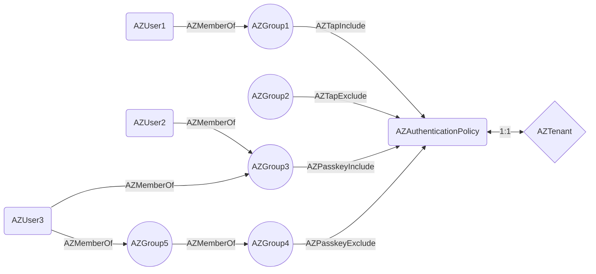
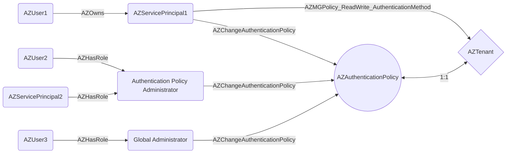
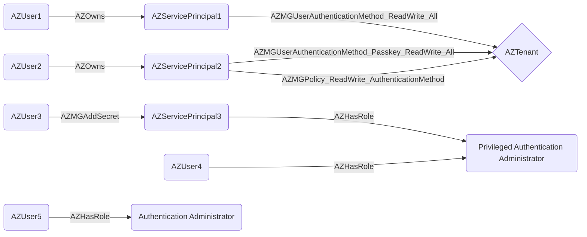

# BloodHound OpenGraph Entra ID Authentication Policy Data Collector


[](#)
[](LICENSE)

## Introduction

### Motivation

This PoC community project provides a sample `PowerShell` script that collects Microsoft Entra ID permissions related
to [Temporary Access Passes (TAPs)](https://learn.microsoft.com/en-us/entra/identity/authentication/howto-authentication-temporary-access-pass)
and [Passkeys (FIDO2 security keys or mobile devices)](https://learn.microsoft.com/en-us/entra/identity/authentication/how-to-enable-passkey-fido2)
and exports the data in [BloodHound OpenGraph](https://specterops.io/opengraph/) format.

TAPs and Passkeys can be registered by privileged malicious actors for other users.
By authenticating with one of these methods afterwards, they can bypass MFA requirements and perform privilege elevation.
This is in principle similar to the [AZResetPassword] edge, but with stronger requirements and more serious impact,
but also more attractive to adversaries as it doesn’t result in the target user losing their ability to authenticate themselves with a password they know.

These authentication methods are disabled by default in the tenant,
so they must be enabled first by a legitimate admin or the malicious actor, if they have the right permissions.

### Authentication Method Registration

TAPs can easily be created for other users by using the [Microsoft Entra admin center](https://entra.microsoft.com),
Microsoft Graph API, or PowerShell:

```powershell
New-MgUserAuthenticationTemporaryAccessPassMethod `
     -UserId 'john.doe@contoso.com' `
     -IsUsableOnce `
     -LifetimeInMinutes 60 | Format-List
```

Sample output:

```yml
Id: 00aa00aa-bb11-cc22-dd33-44ee44ee44ee
CreatedDateTime: 5/22/2022 11:19:17 PM
IsUsable: True
IsUsableOnce: True
LifetimeInMinutes: 60
TemporaryAccessPass: TAPRocks!
```

However, a 3rd-party tool is required to perform administrative registration of Passkeys.
One such utility is the [DSInternals.Passkeys](https://www.powershellgallery.com/packages/DSInternals.Passkeys) PowerShell module:


## Author

### Michael Grafnetter

[](https://x.com/MGrafnetter)
[](https://www.dsinternals.com/en)
[](https://www.linkedin.com/in/grafnetter)

## Collected Data

The following data is collected by the [Get-EntraAuthenticationPolicyData.ps1] PowerShell script from an Entra ID tenant:

### Temporary Access Pass Authentication Method Policy

- [State](https://learn.microsoft.com/en-us/graph/api/temporaryaccesspassauthenticationmethodconfiguration-get?view=graph-rest-1.0&tabs=http)
- [IncludeTargets](https://learn.microsoft.com/en-us/graph/api/resources/temporaryaccesspassauthenticationmethodconfiguration?view=graph-rest-1.0#relationships)
- [ExcludeTargets](https://learn.microsoft.com/en-us/graph/api/resources/temporaryaccesspassauthenticationmethodconfiguration?view=graph-rest-1.0#properties)

### Passkey (FIDO2) Authentication Method Policy

- [State](https://learn.microsoft.com/en-us/graph/api/fido2authenticationmethodconfiguration-get?view=graph-rest-1.0&tabs=http)
- [IncludeTargets](https://learn.microsoft.com/en-us/graph/api/resources/fido2authenticationmethodconfiguration?view=graph-rest-1.0#relationships)
- [ExcludeTargets](https://learn.microsoft.com/en-us/graph/api/resources/fido2authenticationmethodconfiguration?view=graph-rest-1.0#properties)

### Service Principal Permissions

- [UserAuthenticationMethod.ReadWrite.All]
- [UserAuthMethod-Passkey.ReadWrite.All]
- [Policy.ReadWrite.AuthenticationMethod]

## Nodes and Edges

The following new nodes and edges are created based on the data collected:

### AZAuthenticationPolicy Node

This node represents the tenant-wide authentication method policy:


Only a subset of the available settings is ingested into BloodHound. The following **boolean** properties are currently configured on the AZAuthenticationPolicy node:

| Property                | Description                                                                                 |
|-------------------------|---------------------------------------------------------------------------------------------|
| tapEnabled              | Indicates whether the Temporary Access Pass authentication method is enabled in the tenant. |
| tapIncludesAllUsers     | Indicates whether all users are enabled to use Temporary Access Passess.                    |
| passkeyEnabled          | Indicates whether the Passkey authentication method is enabled in the tenant.               |
| passkeyIncludesAllUsers | Indicates whether all users are enabled to use Passkeys.                                    |

### AZTapInclude Edge

| Property        | Value                    |
|-----------------|--------------------------|
| Start node type | [AZGroup]                |
| End node type   | [AZAuthenticationPolicy] |

Groups of users that are enabled to use the Temporary Access Pass authentication method.

### AZTapExclude Edge

| Property        | Value                    |
|-----------------|--------------------------|
| Start node type | [AZGroup]                |
| End node type   | [AZAuthenticationPolicy] |

Groups of users that are excluded from the Temporary Access Pass policy.

### AZPasskeyInclude Edge

| Property        | Value                    |
|-----------------|--------------------------|
| Start node type | [AZGroup]                |
| End node type   | [AZAuthenticationPolicy] |

Groups of users that are enabled to use the Passkey authentication method.

### AZPasskeyExclude Edge

| Property        | Value                    |
|-----------------|--------------------------|
| Start node type | [AZGroup]                |
| End node type   | [AZAuthenticationPolicy] |

Groups of users that are excluded from the Passkey policy.

### Sample Authentication Policy



Note that passkeys cannot be registered for *AZUser3* because of the [AZPasskeyExclude] transitive edge.

### AZMGPolicy_ReadWrite_AuthenticationMethod Edge

| Property        | Value                |
|-----------------|----------------------|
| Start node type | [AZServicePrincipal] |
| End node type   | [AZTenant]           |

This edge represents the tenant-wide [Policy.ReadWrite.AuthenticationMethod] application permission.

### AZChangeAuthenticationPolicy Edge

| Property        | Value                            |
|-----------------|----------------------------------|
| Start node type | [AZServicePrincipal] or [AZRole] |
| End node type   | [AZAuthenticationPolicy]         |

This edge indicates who is in control of the authentication method policies, i.e,
service principals with the [Policy.ReadWrite.AuthenticationMethod] permission and the [Global Administrator] and [Authentication Policy Administrator] roles.

This diagram illustrates the possible relationships:



### AZMGUserAuthenticationMethod_ReadWrite_All Edge

| Property        | Value                |
|-----------------|----------------------|
| Start node type | [AZServicePrincipal] |
| End node type   | [AZTenant]           |

This edge represents the tenant-wide [UserAuthenticationMethod.ReadWrite.All] application permission.

### AZMGUserAuthenticationMethod_Passkey_ReadWrite_All Edge

| Property        | Value                |
|-----------------|----------------------|
| Start node type | [AZServicePrincipal] |
| End node type   | [AZTenant]           |

This edge represents the tenant-wide [UserAuthMethod-Passkey.ReadWrite.All] application permission.

### Privileged Roles

The following privileged roles can register TAPs and Passkeys for users in their delegation scope:

* [Global Administrator]
* [Authentication Policy Administrator]
* [Privileged Authentication Administrator]
* [Authentication Administrator]

Assignments to these roles are collected by [AzureHound] out-of-the-box.

### Sample User Authentication Method Permissions



## Required Entra ID Permissions

The [Get-EntraAuthenticationPolicyData.ps1] PowerShell script reads authentication method policies and service principal permissions.
It therefore requires the following Microsoft Graph delegated permissions (OAuth scopes):

* [Policy.Read.AuthenticationMethod]
* [Application.Read.All]

The user executing the script must be assigned at least the [Directory Readers] role.

## Usage

1. Ingest the base Entra ID data using [AzureHound].
2. Run the [Get-EntraAuthenticationPolicyData.ps1] script to generate a BloodHound OpenGraph JSON file.
3. [Upload](https://bloodhound.specterops.io/collect-data/enterprise-collection/ad-hoc-collection) the generated `AuthenticationPolicyData_*.json` file to BloodHound.
4. Optionally register the `AZAuthenticationPolicy` custom node type by uploading the [CustomNodes.json] file [using the BloodHound API](https://bloodhound.specterops.io/opengraph/custom-icons).
5. Try running the [sample queries](#sample-cypher-queries) or your own ones.

## Files

| File                                    | Description                                                                  |
|-----------------------------------------|------------------------------------------------------------------------------|
| [Get-EntraAuthenticationPolicyData.ps1] | Main script that collects the data.                                          |
| [BloodHound.OpenGraph.Model.psm1]       | Helper PowerShell module implementing the BloodHound OpenGraph data model.   |
| [BloodHound.OpenGraph.Model.Tests.ps1]  | Simple [Pester] test cases for the data model.                               |
| [AuthenticationPolicyData_Sample.json]  | Sample file generated by the `Get-EntraAuthenticationPolicyData.ps1` script. |
| [bloodhound-opengraph.schema.json]      | A [JSON schema] file for BloodHound OpenGraph.                               |
| [CustomNodes.json]                      | Icon and color definitions for the custom node types.                        |

[Get-EntraAuthenticationPolicyData.ps1]: ./Get-EntraAuthenticationPolicyData.ps1
[BloodHound.OpenGraph.Model.psm1]: ./BloodHound.OpenGraph.Model.psm1
[BloodHound.OpenGraph.Model.Tests.ps1]: ./BloodHound.OpenGraph.Model.Tests.ps1
[AuthenticationPolicyData_Sample.json]: ./AuthenticationPolicyData_Sample.json
[bloodhound-opengraph.schema.json]: ./bloodhound-opengraph.schema.json
[CustomNodes.json]: ./CustomNodes.json
[Pester]: https://pester.dev/
[JSON schema]: https://json-schema.org/learn/getting-started-step-by-step

## Sample Cypher Queries

This sections contains sample Cypher queries related to Entra ID authentication method policies.

### Authentication Method Policy

Show the properties of the authentication policy node:

```cypher
MATCH (n:AZAuthenticationPolicy) RETURN n
```


Show entities that are directly in control of the authentication policy:

```cypher
MATCH p=(:AZBase)-[:AZChangeAuthenticationPolicy]->(:AZAuthenticationPolicy) RETURN p
```

Show entities that are indirectly in control of the authentication policy:

```cypher
MATCH directControl=(:AZBase)-[:AZChangeAuthenticationPolicy]->(:AZAuthenticationPolicy) 
MATCH indirectControl=(:AZBase)-[:AZ_ATTACK_PATHS]->(:AZBase)-[:AZChangeAuthenticationPolicy]->(:AZAuthenticationPolicy)
RETURN directControl,indirectControl
LIMIT 1000
```


Show the authentication method policy group inclusions and exclusions:

```cypher
MATCH p=(:AZGroup)-[:AZTapInclude|AZTapExclude|AZPasskeyInclude|AZPasskeyExclude]->(:AZAuthenticationPolicy) RETURN p
```

> [!Warning]
> This query may fail if no edge of a given kind, e.g., [AZTapInclude], exists.

Show the authentication method policy user inclusions and exclusions, while considering nested group membership:

```cypher
MATCH directAssignment=(:AZGroup)-[:AZTapInclude|AZTapExclude|AZPasskeyInclude|AZPasskeyExclude]->(:AZAuthenticationPolicy)
MATCH nestedMembership=(:AZBase)-[:AZMemberOf*1..]->(:AZGroup)-[:AZTapInclude|AZTapExclude|AZPasskeyInclude|AZPasskeyExclude]->(:AZAuthenticationPolicy)
RETURN directAssignment,nestedMembership
```


### User Authentication Method

Show service principals that can register TAPs or passkeys on behalf of other users:

```cypher
MATCH p=(:AZServicePrincipal)-[:AZMGUserAuthenticationMethod_ReadWrite_All|AZMGUserAuthenticationMethod_Passkey_ReadWrite_All]->(:AZTenant)
RETURN p
```


## Known Issues

### BloodHound CE Ingestion

Before uploading the JSON data to BloodHound CE backed by the Neo4j database,
the following code snippet must be deleted first:

```json
"metadata": {
  "source_kind": "EntraTapPasskey"
},
```

Data import would otherwise fail with an error concerning duplicate nodes. This issue is not present when BloodHound is backed by the PostgreSQL database.

### Missing Compound Edges

Non-trivial post-processing of the ingested data would be required
to determine who can register TAPs and Passkeys for whom,
similarly to the [AZResetPassword] edge, especially for the [Authentication Administrator] role delegated at the administrative unit level.
This capability is not available in the current version of BloodHound.

[UserAuthenticationMethod.ReadWrite.All]: https://learn.microsoft.com/en-us/graph/permissions-reference#userauthenticationmethodreadwriteall
[UserAuthMethod-Passkey.ReadWrite.All]: https://learn.microsoft.com/en-us/graph/permissions-reference#userauthmethod-passkeyreadwriteall
[Policy.Read.AuthenticationMethod]: https://learn.microsoft.com/en-us/graph/permissions-reference#policyreadauthenticationmethod
[Application.Read.All]: https://learn.microsoft.com/en-us/graph/permissions-reference#applicationreadall
[Policy.ReadWrite.AuthenticationMethod]: https://learn.microsoft.com/en-us/graph/permissions-reference#policyreadwriteauthenticationmethod
[Global Administrator]: https://learn.microsoft.com/en-us/entra/identity/role-based-access-control/permissions-reference#global-administrator
[Directory Readers]: https://learn.microsoft.com/en-us/entra/identity/role-based-access-control/permissions-reference#directory-readers
[Authentication Policy Administrator]: https://learn.microsoft.com/en-us/entra/identity/role-based-access-control/permissions-reference#authentication-policy-administrator
[Privileged Authentication Administrator]: https://learn.microsoft.com/en-us/entra/identity/role-based-access-control/permissions-reference#privileged-authentication-administrator
[Authentication Administrator]: https://learn.microsoft.com/en-us/entra/identity/role-based-access-control/permissions-reference#authentication-administrator
[AzureHound]: https://github.com/SpecterOps/AzureHound
[AZAuthenticationPolicy]: #azauthenticationpolicy-node
[AZTenant]: https://bloodhound.specterops.io/resources/nodes/az-tenant
[AZGroup]: https://bloodhound.specterops.io/resources/nodes/az-group
[AZServicePrincipal]: https://bloodhound.specterops.io/resources/nodes/az-service-principal
[AZRole]: https://bloodhound.specterops.io/resources/nodes/az-role
[AZResetPassword]: https://bloodhound.specterops.io/resources/edges/az-reset-password
[AZTapInclude]: #aztapinclude-edge
[AZTapExclude]: #aztapexclude-edge
[AZPasskeyInclude]: #azpasskeyinclude-edge
[AZPasskeyExclude]: #azpasskeyexclude-edge
